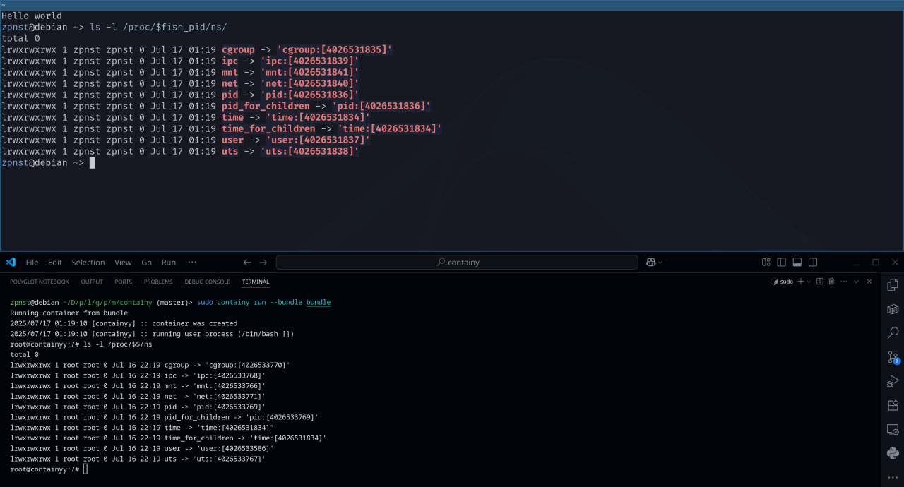
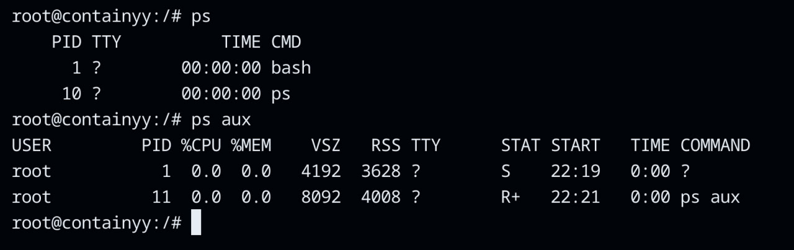
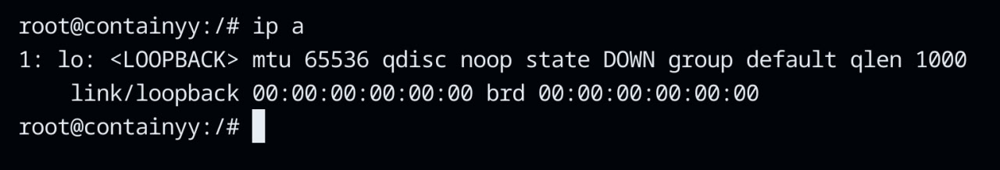
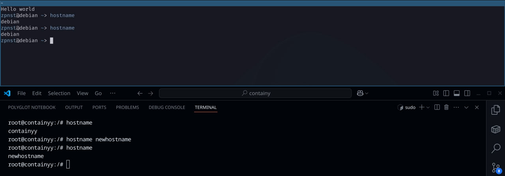
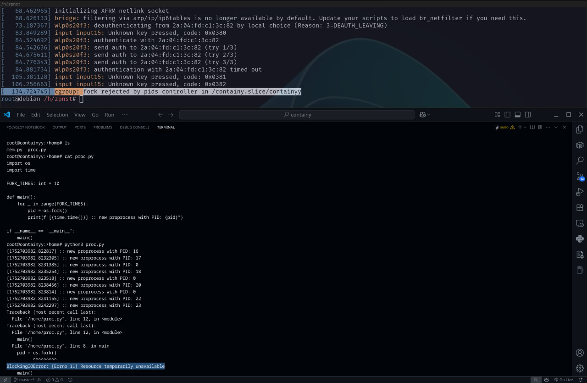
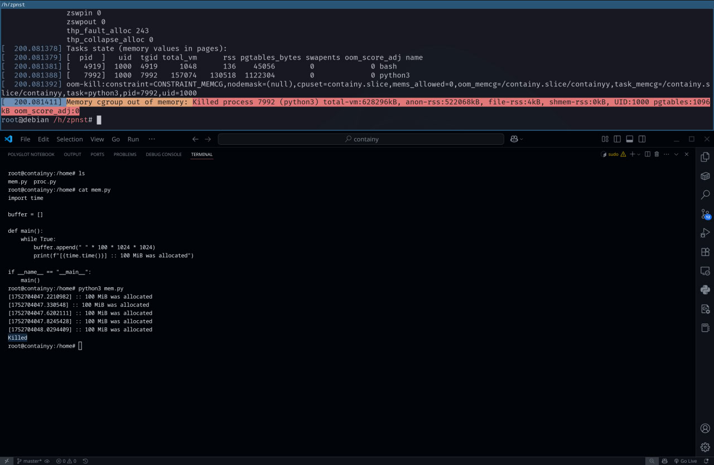

# containy

## Предисловие
Данная реализация больше похожа на `runC` (которым пользуется `Docker`), нежели чем на `Docker`. 
`Containy` умеет создавать процесс в новых `namespaces` (пространствах имён) и добалвять его в `cgroups` (контрольные группы), ограничивая его логические и физические ресурсы. А если вкратце, `Containy` умеет создавать контейнеры =)


Также, `Containy` создаёт `overlayFS`, этот тип файловой системы используется в `Docker`. Она накладывает один “слой” файлов на другой, позволяя создавать общее дерево каталогов. Данный подход помогает экономить место на диске, ведь многие контейнеры могут использовать одну и ту же базовую файловую систему, например `ubuntu` или `debian`. Поэтому мы храним лишь один “снапшот” этой базовой файловой системы, а изменения, которые контейнер вносит в неё, сохраняем отдельно для каждого из контейнеров. При повторном запуске контейнера эти изменения накладываются поверх базовой файловой системы.

Вот почему `Docker` называют “слоёным пирогом”. Тут нет магии, данная файловая система управляется ядром `Linux`, нам лишь нужно смонтировать её куда мы пожелаем.

Одна из таких базовых файловых систем, которые можно скачать из интернета или из того же `Docker Hub` лежит в репозитории в архиве `debian.tar.gz`. На её основе и будет строится файловая система контейнера.

Какие пространства имён применять, какие контрольные группы настраивать и прочие атрибуты контейнера прописывается в файле `configy.json`, аналогично `config.json` в `runC`, только, разумеется, `Containy` не реализует `OCI` =). Как указывать путь к директории, где лежит `config.json` можно посмотреть с  помощью команды `сontainy help`

PS: В примерах синий терминал сверху – это хост, а чёрный снизу – это контейнер. В контейнере запускается `/bin/bash,` но можно, например, запустить и `/usr/bin/python3`.

Все эти настройки делаются через `configy.json:

```json
"cmd": {
    "command": "/bin/bash",
    "cmd_argv": ""
},
```

## Рассмотрим изоляцию на уровне namespaces

### Namespaces

Тут можно сравнить `namespaces` на хосте и в контейнере:



### PID Namespace

Контейнер не видит процессы хостовой системы:



### Network Namespace

Контейнер не видит сетевые интерфейсы хостовой системы, у него есть лишь `loopback(localhost)`:



### UTS Namespace

Также, `hostname` внутри контейнера никак не влияет на `hostname` на хосте и наоборот:



## Рассмотрим  изоляцию на уровне cgroups

В папке `cgroups_example` в репозитории лежат два скрипта на `Python`. Один из них порождает 10 дочерних процессов (`proc.py`), а другой в бесконечном цикле выделяет память (`mem.py`). Их мы будем запускать внутри контейнера, чтобы продемонстрировать, что установленные в `cgroups` ограничения работают

Итак, мы разрешаем контейнеру создать максимум 10 дочерних процессов и выделять не более, чем 512 Мегабайт оперативной памяти

### Запуск proc.py

Как мы видим, программа заканчивается с ошибкой. Сверху выведены логи ядра `Linux`, в них мы можем увидеть, что наш `fork` был отклонён



### Запуск mem.py
Вторую же программу убивает `OOM Killer` на шестую попытку выделить 100 Мегабайт. В логах ядра, опять же, всё видно




## Как запустить: от А до Я

```bash
git clone git@github.com:zpnst/containy.git
cd containy
make extract
./install.sh
sudo containy run --bundle bundle
```

Поздравляю, вы внутри контейнера!

## Литература
- https://habr.com/ru/articles/458462/
- https://habr.com/ru/companies/flant/articles/862252/
- https://habr.com/ru/companies/domclick/articles/566224/
- https://habr.com/ru/companies/selectel/articles/303190/

- https://www.youtube.com/watch?v=t4PEoHAvf1A
- https://www.youtube.com/watch?v=XgThPoL9mPE
- https://www.youtube.com/watch?v=kcnFQgg9ToY

- https://btholt.github.io/complete-intro-to-containers/chroot